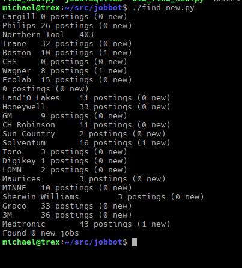
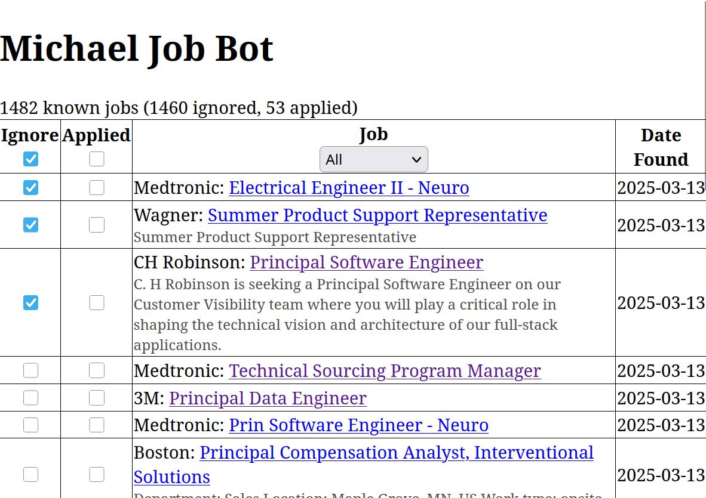

I am currently searching for a new role, and have been spending some real quality time with job listing sites. I want to put together some of my thoughts

Agregators
----------

LinkedIn, Indeed etc. are useful to see what companies are hiring. I'm moving back to a city I used to live in, but there are still lots of companies I didn't know about. 

I'm looking for a mid-sized to large company - companies that are big enough that they should always be hiring for something. If I were targeting small companies, agregators might not be useful at all. 

Individual Job Sites
--------------------

Job Agregators don't have all of a companies jobs. Maybe the company doesn't post them all to LinkedIn, maybe LinkedIn's algorithm doesn't show me what I want. In any case, I have to go to company job sites and check there as well. 

Pet Peeves

* Websites that you can't bookmark your search. 
    - I don't need to see jobs in HR or in India. I will not be in those roles or places. Let me bookmark my search.
* Not listing the job posting date
    - I don't want to apply for a job that has been posted for a month
* Not letting me sort by date posted
    - If there are 50 results, and you only sort by "relevant" do I really have to look at every job listing and hope to find the new ones? 

What's in the box
-----------------

**find_new.py** - looks for new jobs for the configured companies and saves them in jobs.sqlite3

You could run find_new.py as a scheduled task or something like I do, or manually. 

**web/** - some PHP web pages which make a table showing the job listings from the database which haven't been handled yet.

Installation
------------

This isn't a product, just some sample code, really. So you'll have to do some editing yourself.

You'll need to edit both find_new.py and the web scripts to point at the location where your database is.

You'll also need to review the queries I use to check for new jobs and replace them with the ones you're interested in.

Screenshots
-----------

